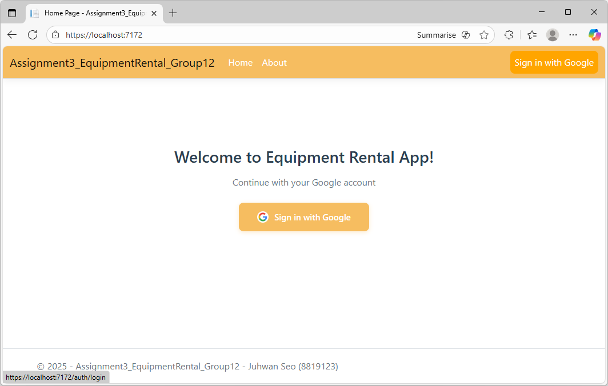
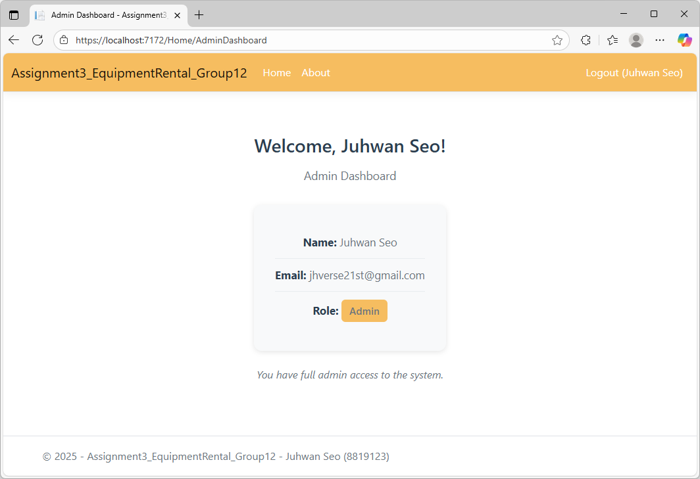
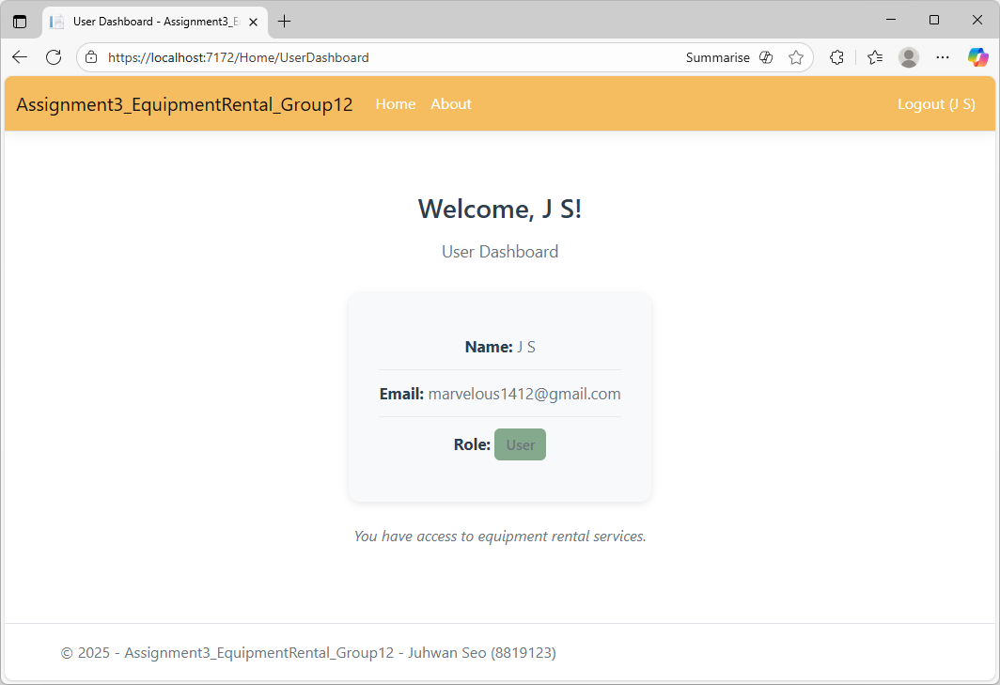
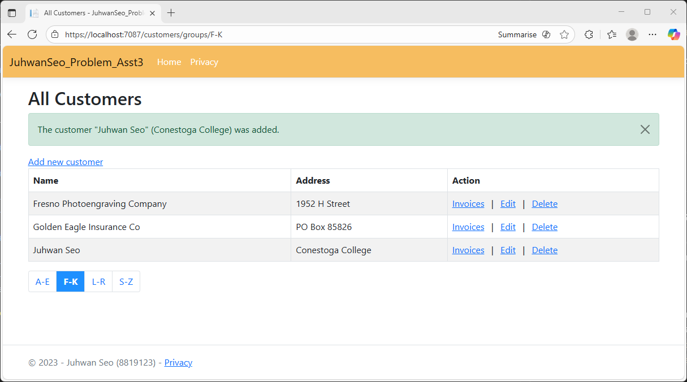
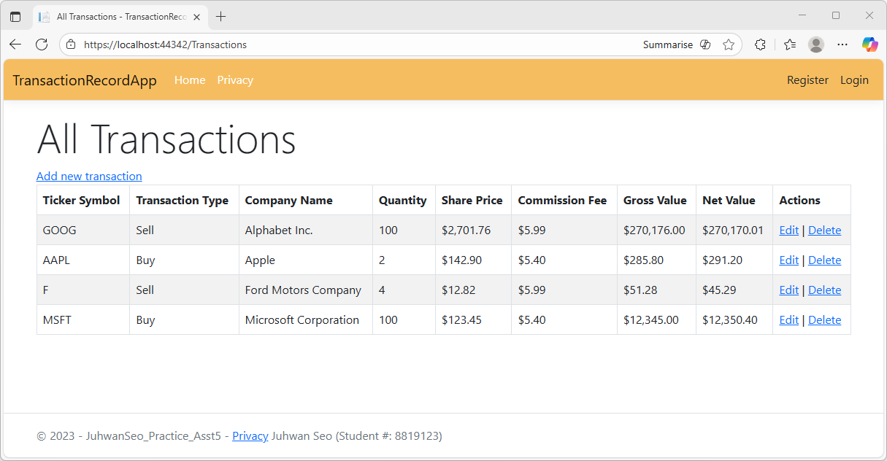

# Assignment 3 - Google OAuth Authentication and Role-Based

---

**Course:** PROG3340 - Fall 2025 - Section 2  
**Project:** Assignment 3 - Google OAuth Authentication and Role-Based Authorization  
**Team:** Group 12  
**Programmed by:** Juhwan Seo [8819123]

**Other Repo**:
[Assignment 1](https://github.com/Juhwan21st/Assignment1_EmployeeAndProductManagementSystem)

**ScreenShots**:





---

## Project Overview

This project enhances the previous Midterm Equipment Rental Management System by replacing existing JWT authentication with Google OAuth (OpenID Connect). The system still maintains role-based authorization using claims.

### Key Features

- Google OAuth 2.0 authentication
- Role-based authorization
- Separate dashboards for Admin and User

---

## Setup Instructions

### How to Run the Application

#### Option A. One-Click Run (Visual Studio 2022, Ver.17.11 +)

If the installed Visual Studio 2022 is newer than Ver.17.11:

1. Open the solution file `Assignment3_EquipmentRental_Group12.sln` in Visual Studio.
2. In the **Debug Profile dropdown** (next to the Run/Debug button),  
   select: `Run-API-and-UI` (Multi-project launch profile)
3. Click **Start** (or Press **F5**) to launch both API and UI projects together.
   - API will start at: `https://localhost:7119/swagger`
   - UI will start at: `https://localhost:7172/`

> **Note:** If there is no option for multi-project profile, update Visual Studio, or follow the Option B for manual run.

---

#### Option B. Manual Run (for older Visual Studio)

**Step 1: Start Backend API**

```powershell
cd Assignment3_EquipmentRental_API_Group12
dotnet run
```

API will start at: `https://localhost:7119/swagger`

**Step 2: Start Frontend UI**

```powershell
cd Assignment3_EquipmentRental_UI_Group12
dotnet run
```

UI will start at: `https://localhost:7172/`

---

### 1. Google Cloud Console Configuration

> **Note**: This setup basically follows the steps covered in Week 9.

**1. Google Cloud Console Access**

- Go to https://console.cloud.google.com/
- Sign in with a Google account

**2. Create a New Project**

- Click "Create Or Select Project"
- Click "New Project"
- Enter project name (`Assignment3-EquipmentRental`)
- Click "Create"
- Select the newly created project from the top dropdown

**3. OAuth Consent Screen Setup**

- Navigate to left menu: **"APIs & Services"** > **"OAuth consent screen"**
- Click "Get Started"
- **Audience**: Select "External"
- **App information**:
  - App Name: Enter `Equipment Rental System`
  - User support email: Select your email
- **Contact information**:
  - Developer contact email: Enter your email

**4. Scopes Configuration**:

- Click **"ADD OR REMOVE SCOPES"**
- Select the following scopes:
  - `openid`
  - `.../auth/userinfo.email`
  - `.../auth/userinfo.profile`

**5. Create OAuth Client ID**

- Navigate to left menu: **"Credentials"**
- Click **"+ CREATE CREDENTIALS"** > **"OAuth client ID"**
- **Application type**: Select **"Web application"**
- **Name**: Enter `Equipment Rental Web Client`

- **Authorized redirect URIs**:
  ```
   https://localhost:7172/signin-google
  ```
  - the port number is the frontend project's HTTPS port

**6. Copy ClientId and ClientSecret**

- Copy the **Client ID** and **Client secret** from the popup window
- Paste these values into `appsettings.json` like below.

---

### 2. Project Configuration

#### Frontend (`Assignment3_EquipmentRental_UI_Group12`)

**File**: `appsettings.json`

```json
{
  "Authentication": {
    "Google": {
      "ClientId": "The Client ID",
      "ClientSecret": "The Client Secret"
    }
  },
  "AuthDemo": {
    "AdminEmails": ["admin email"]
  },
  "Api": {
    "BaseAddress": "https://localhost:{the api project's url}/"
  },
  "Jwt": {
    "Issuer": "Assignment3_EquipmentRental_UI_Group12",
    "Audience": "Assignment3_EquipmentRental_API_Group12",
    "SigningKey": "put_anything_here_that_is_at_least_64_characters_to_make_it_secure_123456"
  }
}
```

#### Backend (`Assignment3_EquipmentRental_API_Group12`)

**File**: `appsettings.json`

```json
{
  "Jwt": {
    "Issuer": "Assignment3_EquipmentRental_Frontend_Group12",
    "Audience": "Assignment3_EquipmentRental_Group12",
    "SigningKey": "put_anything_here_that_is_at_least_64_characters_to_make_it_secure_123456"
  }
}
```

---

## Default Admin Email for Testing

**Admin Account**:

- **Email**: `jhverse21st@gmail.com`
- **Role**: Admin
- **Access**: Admin Dashboard (Full system management)

---

## Demo Video

**Clipchamp Video Link**:

---

## References

### Multi-Project Startup and Launch Profile(.slnLaunch) References

- Martin Zikmund. (2024, March 26). _Using Multi-Project Launch Profiles in Visual Studio_ [Video]. YouTube. https://www.youtube.com/watch?v=Zj2YGHQ9a94&t=1s
- Microsoft. (2024). _How to: Set multiple startup projects in Visual Studio_. Microsoft Learn. https://learn.microsoft.com/en-us/visualstudio/ide/how-to-set-multiple-startup-projects?view=vs-2022
- JetBrains. (2025). _Support extracting Multi-Project Launch Profiles from .slnLaunch file (Issue RIDER-114145)_. JetBrains YouTrack. https://youtrack.jetbrains.com/projects/RIDER/issues/RIDER-114145/Support-extracting-Multi-Project-Launch-Profiles-from-.slnLaunch-file

### Week 9 Class Materials

- Lecture Note(that I made during the class) and the practice project examples
- Google OAuth 2.0 setup and configuration

### Previous Course Work

- **PROG2230 - Programming: Microsoft Web Technologies** (Fall 2023 - Section 1)
- Frontend layout and Razor Views design referenced from previous ASP.NET Core MVC assignments:
  - `JuhwanSeo_Problem_Asst3` - CRUD structure and UI patterns and layout design
    
  - `TransactionRecordApp` - Login/logout UI patterns and layout design
    
